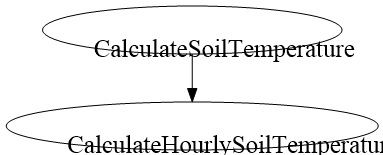

[](https://doi.org/10.5281/zenodo.4292231)


AgriculturalModelExchangeInitiative
==============================

Model of Soil Temperature of the crop growth simulation model SiriusQuality

Project Organization
------------

```

    ├── LICENSE.txt        <- License file
    ├── README.md          <- The top-level README for AMEI members using this project.
    │
    ├── doc/               <- Package documentation
    │
    ├── test/             <- model tests for each language and platform
    │
    ├── crop2ml/          <- model units and composite in crop2ml format.
    │      ├── xml files
    │      ├── Algo/
    |
    │
    ├── src/                <- Executable source in different language and platform
    │   ├── pyx/
    │   ├── java/
    │   ├── py/
        ├── R/
        ├── cpp/
        ├── cs/
        ├── f90/
        ├── Simplace/
        ├── OpenAlea/
        ├── DSSAT/
   
```

Model visualization
-------------------


